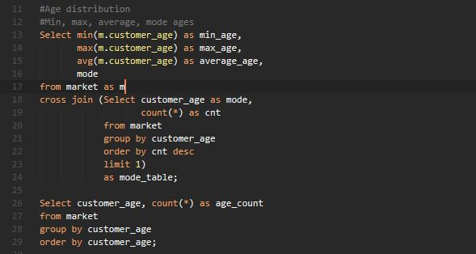

# Bike Store Sales Analysis with SQL

## Introduction
This is a mini analysis on the sales of a bike store. It involves analysis of the Sales of this store from January 2015 to July 2016.
General statistics of the data columns were caried out, Analysis based in location (Countries and states having access to the products)
and Product analysis.
There are three .sql files --> analysis.sql, products.sql and location.sql each having different sql querries for different problems

## Skills Dmonstrated:
    The following SQL skills were demonstrated during this project:
    Subquerries, Window Functions, Statistics

## Problem Statements
- What is the distribution of the age group of our customers.
- Amount of money spent by our customers. (Avg revenue per customer, Minimum and Maximum amount of money spent by our customer)
- What is the revenue generated in the different countries and states that have access to our products
- What products are driving these sales and revenues in these states.
- The trend of sales over time in these states
- Sales volume across these states
- The distribution of sales in the states for different countries
- Age distribution of our customers for each of these countries
- What product category is driving the most and least sales generally
- Who are our target customers (male and female distributions)
- what months of the year do these products have the most and the least sales.

## Data Sourcing
This is single table consisting of 15 columns which are as follows:
- index: Key of the table
- Date: Date of sales( From january 2015 to January 2016)
- Year: Year of sales
- Month: Month of sales
- Customer Age
- Customer Gender: Male or Female
- Country: Country where sales was made
- State: State where sales was made
- Product Category
- Sub Category
- Quantity: Quantity of the product ordered by the customer
- Unit Cost
- Unit Price
- Cost
- Revenue: total revenue on the purchase by the customer for that day or order.

This table consists of 34,866 rows.
This dataset was gotten from kaggle.

## Modelling.
This is a flat data and consist of just one table, so no data modelling was done.

## Analysis
### Code for General Statistics.
- Mean, Mode, Average, Variance and Standard Deviation of the Age of the customers

age_stats.JPG

- General statistics of the Revenue and Quantity columns

### Code for Location analysis
- Revenue generation in these countries

- Sales volume in these countries

- The trend of sales over the years in these countries

- The products driving sales and quantity ordered in these countries

- How many states in these countries have access to our product

- The distribution of sales across these states that have access to the products

- Age distribution of the customers in these country

### Code for Product analysis
- The sales, profit and volume of the products

- How many states have access to each of these products

- Who are the target customers (Male and female)

- Revenue, profit and volume of the ssubcategories

- Trend of sales of the products

## Conclusion and Recommendation
- The majority of our clients seem to be younger people between ages of 20 to 45
- The average revenue per user is about $640.
- The MOM sales increased from 2015 to 2016 showing profitability with the highest sales recorded in the last months of the year
- The United States is where we made the highest sales of over $10M from January 2015 to July 2016 with UK, Germany and France following in that order.
- Among the four countries, only The United States and France have atleast 10 states with access to our products. Germany has only 6 and UK has Just one state having access to our products
- Despite so many states in United States having access to our products, Just very few of these states generate high revenue. 99% of the sales in the U.S.A came from just 3 states out of the 22 states. Only France has a good revenue distributuon across its states
- Bikes are making the most sales while accessories are having the highest volume.
- Mountain bikes seem to make most of the sales but road bikes are the most orderd and are very profitable

- More advert and maretting should be done on the accessories of bikes
- More advert and maretting should be done in our states of the countries to even our the revenue generations
- More Sales discount can be made during the summer months to increase sales of the bikes and it's accesories

